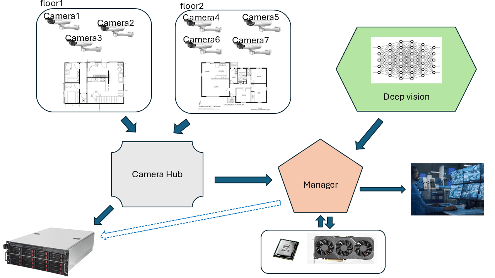
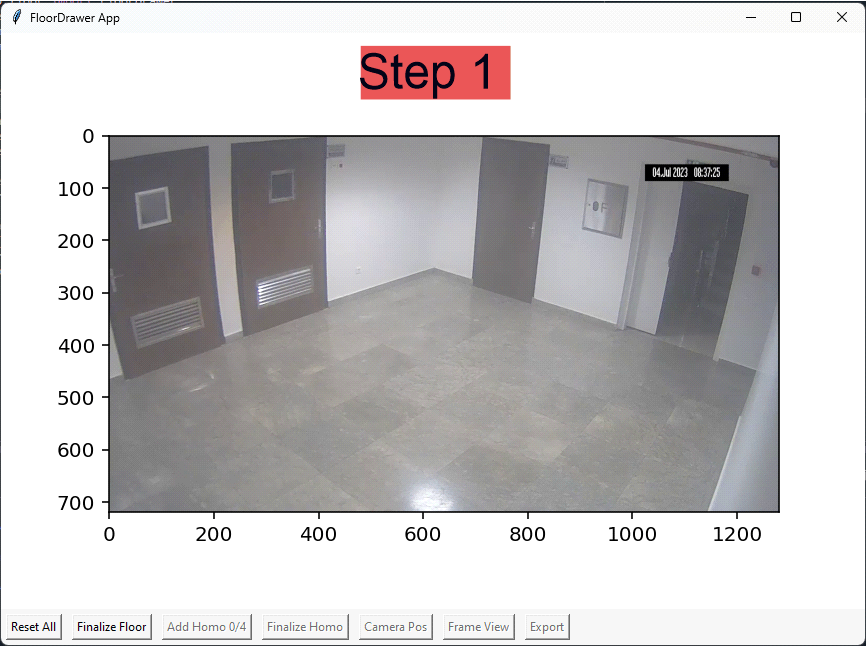

# 🎥 Deep Learning-Powered CCTV Data Processing and Analysis 

## 📝 Overview

This project provides a flexible and scalable framework to **process, analyze, and visualize CCTV camera data using deep learning models**. 
It is designed to handle multiple cameras across different floors, perform real-time computer vision tasks like **person detection, multi-camera tracking**, and **bird’s-eye view transformations**, and make the processed information available for **monitoring, alerts**, analytics, or any **custom purpose**. 
The system is modular and expandable — allowing easy development for various applications such as population analysis, event detection, visual reporting, or security monitoring.

## 🧩 System Architecture

The overall data flow of the system:
1. **Data Ingestion:**
CCTV streams from multiple cameras (across different floors) are collected through a Camera Hub.
2. **Storage Server:**
Raw or preprocessed camera data is optionally saved for further offline processing.
3. **Processing Manager:**
A central manager leverages deep neural networks and device resources (e.g., GPUs, edge devices) to run heavy computer vision tasks.
4. **Results Management:**
Outputs are saved back to the storage server and forwarded to the Monitoring System for visualization and operational use.

  

## ⚙️ Features
- 🚀 Scalable multi-camera data ingestion

- 🧠 Deep Learning-based object detection and tracking

- 🗺️ Bird's-eye view floor visualization

- 🛠️ Flexible framework for custom purposes (counting, alerting, analytics, etc.)

- 📊 Centralized storage and result management

- 🖥️ Designed for real-time and offline analysis

## 🎬 Visualization and Results

The system provides visual feedback including:
- Real-time detection results
- Bird’s-eye view transformation across multiple cameras
- Tracking of individuals throughout different floor plans

  

## 🛠️ Camera Calibration for Bird’s-Eye View Transformation

To accurately transform each camera’s view into a bird’s-eye (floor plan) perspective, an initial **calibration step** is required. 
We have designed an easy-to-use **GUI application built with `Tkinter`** to help users perform the calibration effortlessly. 
This calibration is done **only once per camera**, and the computed parameters are saved for future use.

Calibration involves these steps:

- **🎯 Select Region of Interest (ROI):**

  The user defines an area within the camera view that should appear in the bird’s-eye visualization.

- **🧩 Match Reference Points:**

  The user sets several corresponding points between the **camera view** and the **floor plan**. These points are used to compute a **homography transformation**.

- **🗺️ Place Camera on Floor Plan:**

  The user positions the camera accurately on the floor plan to provide a correct spatial reference.

- **💾 Save Calibration Data:**

  All calibration details are saved into a structured **JSON file**, making it easy for the Camera Handler modules to read and use during live processing.

> 🎞️ Below you can see a GIF demonstrating the complete calibration process step-by-step.

  

## 🧠 Extending Computer Vision Capabilities

In addition to standard object detection and person tracking, this framework is **designed for flexible expansion** by integrating additional deep learning models to extract richer analytics from CCTV streams.

We have already developed and integrated several extra models, including:

- **👤 Face Detection:**

  Detect and locate faces in the camera feeds.

- **🕺 Body Keypoint Detection:**

  Identify and track key points on the human body (e.g., head, shoulders, knees).

- **🎯 Action Detection:**

  Recognize human activities or specific motions within the monitored areas.

These new capabilities can be **plugged into the Manager module** to enhance analytics, but **note**: 
Adding these complex models increases **computational cost** and **processing time**, potentially impacting real-time performance.

> 🎞️ Below you can see a GIF demonstrating these extra computer vision features.

  

## 🔮 Future Developments
We are actively working on adding even more advanced functionalities:

- **🆔 Face Identification:**  

  Recognize and identify individuals based on their detected faces.

- **🔄 Person Re-Identification (Re-ID):**

  Track the same person across different cameras without relying solely on appearance in each frame.

- **🗄️ Database Communication:**

  Save processed analytics data to a database and retrieve necessary information for advanced analysis and reporting.

These future features will make the system even more intelligent, scalable, and suitable for real-world surveillance and business intelligence applications.

## 📢 Important Note

This repository has been created to **showcase the design, architecture, and results** of my work in applying deep learning to CCTV data analysis as a **computer vision** task.
Due to **institutional copyright policies**, the full project code cannot be shared publicly at this time.

Thank you for your interest and understanding.

